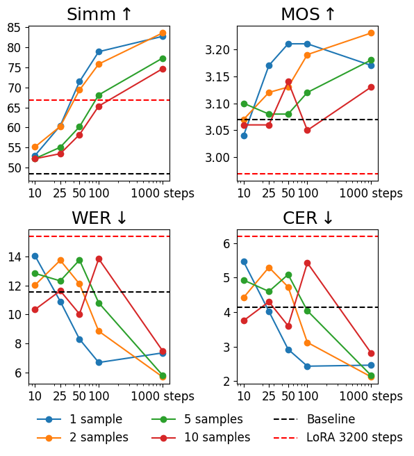
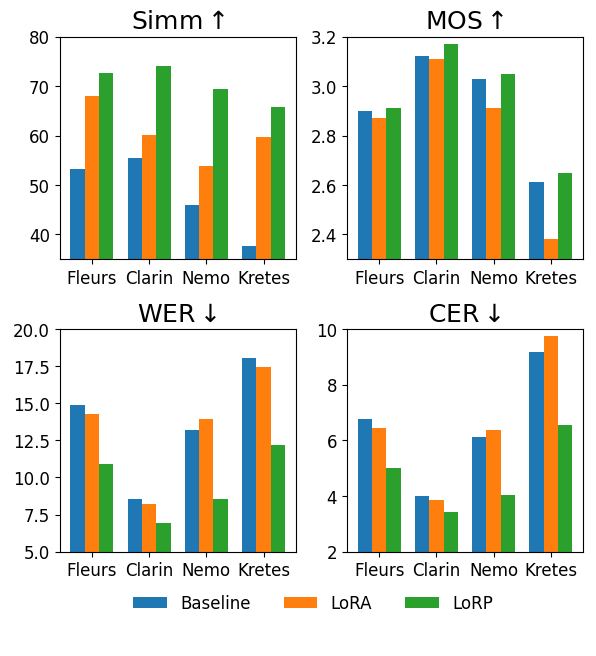

# LoRP-TTS: Low-Rank Personalized Text-To-Speech

## Abstract
Speech synthesis models convert written text into natural-sounding audio. While earlier models were limited to a single speaker, recent advancements have led to the development of zero-shot systems that generate realistic speech from a wide range of speakers using their voices as additional prompts. However, they still struggle with imitating non-studio-quality samples that differ significantly from the training datasets. In this work, we demonstrate that utilizing Low-Rank Adaptation (LoRA) allows us to successfully use even single recordings of spontaneous speech in noisy environments as prompts. This approach, further called LoRP enhances speaker similarity by up to **30pp** while preserving content and naturalness. It represents a significant step toward creating truly diverse speech corpora, that is crucial in all speech-related tasks.

## Audio Samples 🔊

To listen samples of LoRP method visit the [demo webpage](https://samsunglabs.github.io/LORP/).

## Results

### Fine-tuning on a single sample for a small number of steps can achieve the same or even superior results compared to long fine-tuning on a large dataset

### The observed improvements are consistent across a wide range of datasets, demonstrating their robustness and generalizability

* **Kretes** voice of character from the Reksio children's series. Contains approximately 2 hours of speech from a single speaker, captured in various environments and intonations, with distinct characteristics that significantly differ from the training data. It is notably exaggerated, resembling the expressive and theatrical tones often associated with characters in role-playing games.
* **[Clarin](https://arxiv.org/abs/1706.00245)** Polish read speech corpus for speech tools and services known for its high-quality, studio recordings.
* **[Fleurs](https://arxiv.org/abs/2205.12446)** more diverse dataset commonly used in ASR and translation tasks to represent real-world conditions.
* **[Nemo](https://arxiv.org/abs/2404.06292v1)** dataset focused on emotional expression across a small group of speakers.
